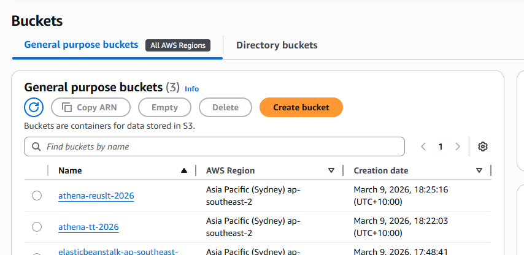
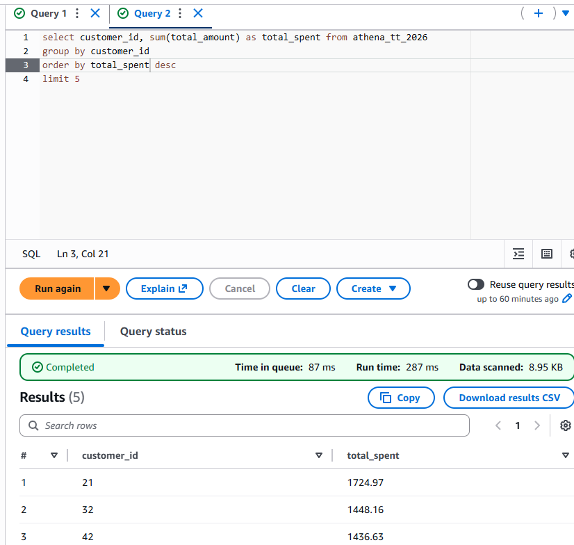

# AWS S3 CSV Query with Athena and Glue

## Overview
This project demonstrates how to store a CSV dataset in an Amazon S3 bucket and query it using AWS Athena. AWS Glue is used to crawl the dataset and automatically create a table schema in the AWS Glue Data Catalog.

The architecture allows serverless querying of CSV data without managing any infrastructure.

## Architecture
The workflow is:

1. Upload CSV file to Amazon S3
2. AWS Glue Crawler scans the data
3. Glue creates a table schema in the Glue Data Catalog
4. AWS Athena queries the data directly from S3

## Technologies Used

- AWS S3
- AWS Glue Crawler
- AWS Glue Data Catalog
- AWS Athena
- CSV dataset

## Project Structure

## Setup Instructions

### 1. Create an S3 Bucket
Create an S3 bucket and upload your CSV file.


AWS documentation:  
https://docs.aws.amazon.com/AmazonS3/latest/userguide/create-bucket-overview.html

---

### 2. Create a Glue Crawler

1. Go to AWS Glue
2. Select **Crawlers**
3. Click **Create crawler**
4. Set the data source as your S3 bucket
5. Configure an IAM role
6. Set the output database
7. Run the crawler

The crawler will infer the schema and create a table in the **Glue Data Catalog**.

Documentation:  
https://docs.aws.amazon.com/glue/latest/dg/add-crawler.html

---

### 3. Query the Data with Athena

1. Open AWS Athena
2. Select the database created by Glue
3. Run SQL queries on the generated table

Example query:

```sql
SELECT *
FROM sample_table
LIMIT 10;
## Screenshots




